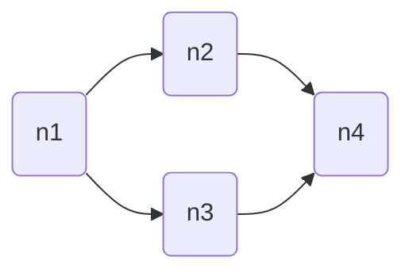
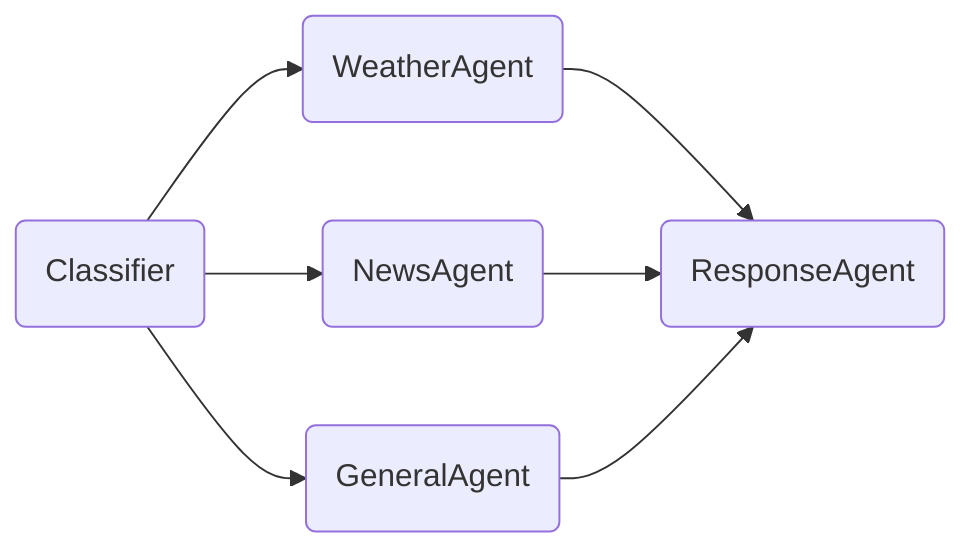

# NodesIO

**Async DAG workflow engine for Python — built for AI agents, designed for everything else.**

NodesIO lets you build and run parallelizable async workflows by just connecting Python objects. No YAML. No extra decorators. No special nodes tipes (branching, merging, skipping, etc). No framework to learn. If you know how to write a dataclass, you already know how to use it.

```python
@dataclass
class Summarize(Node):
    async def execute(self, ctx) -> str:
        return await llm(ctx.inputs.outputs[0])

@dataclass
class Translate(Node):
    language: str
    async def execute(self, ctx) -> str:
        return await llm(f"Translate to {self.language}: {ctx.inputs.outputs[0]}")

summarize = Summarize(name='summarize')
translate_pt = Translate(name='translate_pt', language='Portuguese')
translate_es = Translate(name='translate_es', language='Spanish')

summarize.connect(translate_pt)
summarize.connect(translate_es)

# translate_pt and translate_es run concurrently, automatically
result = await summarize.run(NodeIO(..., output=article))
```

---

## Why NodesIO

Most workflow libraries force a tradeoff: a simple, opinionated system that only does what its authors anticipated, or a powerful one drowning in executors, schemas, state stores and framework-specific abstractions. Either way, you end up writing *framework code* instead of Python.

NodesIO bets that **the graph itself is the only abstraction you need** — and that nodes should just be Python. Each node is an arbitrary program that receives inputs, does whatever it wants, and returns an output. Read files, call APIs, hold state, import any library, spawn subprocesses — no sandbox, no restricted execution model, no special primitives. No `from framework.integrations.llm.providers.openai.chat import TightlyCoupledOpenAIChatWrapperV2` — just import the original module you need and use it.

What the engine adds on top is purely structural: automatic parallelization at forks, guaranteed input ordering at joins, session isolation for concurrent users, dynamic routing at runtime, and per-session memory that requires zero effort to use (it's literally just the node's own class attributes). All of it derived from the graph topology, without you having to think about it.

--- 

## Installation

```bash
git clone https://github.com/dnoak/nodesIO.git
cd nodesIO
pip install -e nodesIO
```

---

## Core Concepts

### Nodes

A node is a dataclass that inherits from `Node` and implements `async def execute(self, ctx) -> type`. That's it.

```python
@dataclass
class MyNode(Node):
    # your node's persistent memory lives here as regular attributes
    history: list[str] = field(default_factory=list)

    def upper_and_split(self, text: str) -> list[str]: # custom method
        return text.upper().split()

    async def execute(self, ctx) -> list[str]:
        value = ctx.inputs.outputs[0]
        self.history.append(value)   # persists across executions in the same session
        return self.upper_and_split(value)
```
Nodes are independent input/output units. They just await for its inputs, runs its logic, and forward the result to its output nodes. Nothing more — which makes them naturally composable and testable in isolation.

A few rules:
- Every node must have a unique `name` when instantiated
- `config` is a reserved attribute for the node configuration
- `execute` must be `async`, and `node.run()` must be `awaited`
- Nodes can have arbitrary regular methods too
- Attributes defined in the dataclass are the node's **persistent session memory** — their values survive between executions within the same session

---

### Connecting Nodes

When a node has multiple outputs, all of them are launched as concurrent async tasks automatically.
```python
a.connect(b)        #     ↗ b →    [b, c, d] run concurrently
a.connect(c)        # a →   c →    and `a.run(...)` returns:
a.connect(d)        #     ↘ d →    [NodeIO(source=b, ...), NodeIO(source=c, ...), NodeIO(source=d, ...)]
```

When a node has multiple inputs, it waits for all of them before executing — with input ordering guaranteed regardless of which arrives first.

```python
a.connect(d)        # a ↘          d only runs when all of its inputs are ready:
b.connect(d)        # b  → d       `a.run(...) `, `b.run(...)` and `c.run(...)`
c.connect(d)        # c ↗          returns `[NodeIO(source=d, ...)`
```

`connect()` returns the target node, so chains can be written fluently:

```python
a.connect(b).connect(c)    # a → b → c   # `a.run(...)` returns `[NodeIO(source=c, ...)]`
```

---

### Running a Workflow

Every value that flows through the graph — whether entering a node or leaving it — is a `NodeIO`. It's the single currency of the engine: what you pass in is the same shape as what you get back.
```python
result = await start_node.run(NodeIO(
    source=NodeIOSource(session_id='user_42', execution_id='exec_1', node=None),
    status=NodeIOStatus(),
    output=your_input_data,
))
```

The three fields:

- **`source`** — identifies where this value came from. `session_id` groups executions under the same user or context; `execution_id` identifies this specific run within that session. `node` is the node that produced it — `None` when it's an external input coming from outside the graph.
- **`status`** — whether this value represents a successful result, a skipped node, or a failure. When you're feeding the graph from outside, `NodeIOStatus()` with no arguments means success. A non-success status will propagate a `skip` to downstream nodes, and they all will be skipped.
- **`output`** — It's the "previous node's" output. In the first node entry (`source=None`), it's the actual input. Can be any Python type.

`result` is a list of `NodeIO` objects — one per terminal node (nodes with no output connections). The same fields are there: `result[0].output` is the value, `result[0].source.node` is which node produced it, `result[0].status.execution` tells you if it ran or was skipped.

---

### Sessions

Sessions are the mechanism that makes NodesIO safe for multi-user, concurrent use.

When you call `run()` with a new `session_id`, the engine deep-copies the entire workflow into an isolated session. From that point on, every execution under that session_id operates on its own graph — node attributes, memory, everything. Sessions from different users never interfere.

```
                           ┌─────────────────────────────┐
                           │  session: 'user_42'         │
                           │  ┌───┐   ┌───┐   ┌───┐      │
                           │  │ a │──>│ b │──>│ c │      │
                           │  └───┘   └───┘   └───┘      │
  Constructor Workflow     │  (isolated copy, own state) │
  ┌───┐   ┌───┐   ┌───┐    └─────────────────────────────┘
  │ a │──>│ b │──>│ c │    ┌─────────────────────────────┐
  └───┘   └───┘   └───┘    │  session: 'user_99'         │
  (template)               │  ┌───┐   ┌───┐   ┌───┐      │
                           │  │ a │──>│ b │──>│ c │      │
                           │  └───┘   └───┘   └───┘      │
                           │  (isolated copy, own state) │
                           └─────────────────────────────┘
```

Sessions have a configurable TTL. When a session hasn't been accessed for longer than the TTL, it's cleaned up automatically:

```python
Node.workflow.sessions_ttl = 300  # seconds; None to disable
```

---

### Session Memory

Each session has two layers of memory:

**Node-level memory** — the node's own attributes. Each session has its own copy, so changes made during one session don't leak into others:

```python
@dataclass
class Counter(Node):
    count: int = 0

    async def execute(self, ctx) -> int:
        self.count += 1   # only affects this session's copy
        return self.count
```

**Session-level shared memory** — Custom objects accessible to all nodes in the same session via `ctx.session.memory`. Useful for cross-node communication within a session:

```python
async def execute(self, ctx) -> str:
    ctx.session.memory.shared['last_query'] = ctx.inputs.outputs[0] # custom arbitrary dict
    ctx.session.memory.messages.append(ctx.inputs.outputs[0]) # custom list, useful for chatbots
    return 'stored'
```

---

### Dynamic Routing

By default, when a node finishes, all its connected outputs receive the result. You can override this at runtime to implement branching logic:

```python
@dataclass
class Router(Node):
    config: NodeExecutorConfig = NodeExecutorConfig(    # reserve attribute for config
        routing_default_policy='broadcast' # or `skip` to auto-skip all outputs
    )

    async def execute(self, ctx) -> str:
        # logically skip all outputs by default
        ctx.routing.clear() # or ctx.routing.skip(['path_A', 'path_B', 'path_C'])
        # then enable only what you want
        ctx.routing.add('path_A')
        ctx.routing.add('path_B') # or all-in-one: ctx.routing.add(['path_A', 'path_B'])
        return ctx.inputs.outputs[0]
```

Routing decisions don't require special node types. Any node can decide where execution goes next — including sending to none of its outputs, all of them, or any subset. By this method, you can only skip or add nodes that are already connected in the constructor graph, trying to skip or add a node that's not connected will raise an error. But you can dynamically change the graph topology manipulating the internal methods `self._input_nodes` and `self._output_nodes`, the graph will be automatically updated without 'recompiling' the workflow.

When a downstream node receives a `skipped` input, it propagates the skip forward automatically. The result object will contain `NotProcessed()` for nodes that were intentionally bypassed.

---

### Subset Execution

Because nodes are independent input/output units, you can start execution from any node in the graph — not just the first one:

```python
# Full workflow: A → B → C → D
# Run only the last two nodes:
partial_result = await c.run(NodeIO(..., output=some_data))
```

This is useful for debugging, for partial re-runs, and for building workflows where different entry points are valid depending on context.

---

### Plotting

```python
any_node.plot()                       # opens as image
any_node.plot(mode='html')            # opens in browser or image (requires graphviz)
any_node.plot(show_methods=False)     # hide custom methods
```

The plot shows every node, its output type, and its custom methods. It reads the workflow from the constructor graph.

---

## The Execution Context

Inside `execute`, the `ctx` object gives you everything the node needs to know about its current workflow, session, execution, inputs and routing:

| Attribute | Type | Description |
|---|---|---|
| `ctx.inputs` | `NodeExecutorInputs` | Inputs received by this node. Acessed by `ctx.inputs['node_name']: NodeIO` for a specific input, or `ctx.inputs.outputs: list[Any]` for only the values. The start input key (when `source=None`) is always `__input__` |
| `ctx.routing` | `NodeExecutorRouting` | Control which downstream nodes receive output. Can `.add(str \| list[str])` or `.skip(str \| list[str])` nodes; or `.clear()` and `.broadcast()` all nodes |
| `ctx.session` | `Session` | Current session data: `.id`, `.nodes`, `.executions`, `.memory`. For accessing session memory, the graph nodes objects and execution history. |
| `ctx.execution` | `Execution` | Current execution data: `.id`, `.nodes`. For acessing the current execution in another nodes |
| `ctx.workflow` | `Workflow` | The global workflow: `.sessions`, `.sessions_ttl`. Useful for cross-session interactions |
---

## Examples

#### Neural Network (Multi-Layer Perceptron)

Originally built for AI agents, the engine turned out robust enough for two **Machine Learning** stress tests: a ~1 million parameter fully-connected MLP running an inference-only network in ~20 seconds, and an another MLP for circle classification, trained end-to-end with backpropagation — where inverting the graph topology for the backward pass is a simple single method:
```python
def toggle_train_mode(self):
    self._input_nodes, self._output_nodes = self._output_nodes, self._input_nodes
```

A terrible way to train a neural network? Absolutely. But that's the point — if the engine can handle this without becoming the bottleneck, it won't bottleneck anything it was actually designed for. (this 2 examples are in `tests/examples/neural_network/`)

Bellow, a basic example of a fully-connected MLP where each neuron is a node.



```python
@dataclass
class Neuron(Node):
    w: list[float]  # can be updated when backpropagation is implemented
    b: float        # and persists memory across executions

    async def execute(self, ctx) -> float:
        x = np.array(ctx.inputs.outputs)
        z = x @ self.w + self.b   # dot product
        return float(max(z, 0.))  # ReLU

n1 = Neuron(name='n1', w=[1], b=0)
n2 = Neuron(name='n2', w=[2], b=0)
n3 = Neuron(name='n3', w=[3], b=0)
n4 = Neuron(name='n4', w=[4, 5], b=0)

n1.connect(n2)
n1.connect(n3)
n2.connect(n4)
n3.connect(n4)

async def main():
    result = await n1.run(NodeIO(
        source=NodeIOSource(session_id='s1', execution_id='e1', node=None),
        status=NodeIOStatus(),
        output=1,
    ))

asyncio.run(main())

>>> result[0].output
>>> 23.0
```

---

#### AI Agent with Routing

A practical example closer to the original motivation: a classifier that routes user messages to specialized handlers, with each user session maintaining its own isolated state.

```python
@dataclass
class Classifier(Node):
    async def execute(self, ctx) -> str:
        query = ctx.inputs.outputs[0]
        ctx.routing.clear()
        if 'weather' in query.lower():
            ctx.routing.add('weather_agent')
        elif 'news' in query.lower():
            ctx.routing.add('news_agent')
        else:
            ctx.routing.add('general_agent')
        return query

@dataclass
class WeatherAgent(Node):
    async def execute(self, ctx) -> str:
        return await fetch_weather(ctx.inputs.outputs[0])

@dataclass
class NewsAgent(Node):
    async def execute(self, ctx) -> str:
        return await fetch_news(ctx.inputs.outputs[0])

@dataclass
class GeneralAgent(Node):
    async def execute(self, ctx) -> str:
        return await llm(ctx.inputs.outputs[0])

@dataclass
class ResponseAgent(Node):
    response_style: Literal['formal', 'casual']
    async def execute(self, ctx) -> str:
        return await llm(self.response_style, ctx.inputs.outputs[0])

classifier = Classifier(name='classifier')
weather_agent = WeatherAgent(name='weather_agent')
news_agent = NewsAgent(name='news_agent')
general_agent = GeneralAgent(name='general_agent')
response_agent = ResponseAgent(name='response_agent', response_style='formal')

classifier.connect(weather_agent).connect(response_agent)
classifier.connect(news_agent).connect(response_agent)
classifier.connect(general_agent).connect(response_agent)

# FastAPI example: a real-world use case
# every request runs in concurrent and isolated sessions, no coordination needed.
@app.post("/classify")
async def classify(user_id: str, query: str):
    return await classifier.run(NodeIO(
        source=NodeIOSource(user_id, uui.uuid4(), None),
        status=NodeIOStatus(), 
        output='weather in Tokyo'
    ))

```

---

## Design Decisions

**One process, one workflow.** NodesIO doesn't support multiple workflows within the same process. If you need two independent pipelines, run two different processes. This keeps the mental model flat and the engine fast — there's no ambiguity about where a node belongs.

**No special node types.** Branching, merging, skipping, looping — all of these are handled internally by regular nodes using ctx.routing. You don't need to learn a vocabulary of node types; you write Python.

**Sessions over shared state.** Every session is a deep copy of the constructor workflow. Concurrent users are fully isolated without any locking or coordination on your part.

**Runtime topology.** The graph direction is resolved at runtime, not precompiled. This means you can invert the graph, add connections conditionally, or swap inputs and outputs dynamically — as the neural network backward pass example demonstrates. But since it's a DAG, the only restriction is not to have cycles.